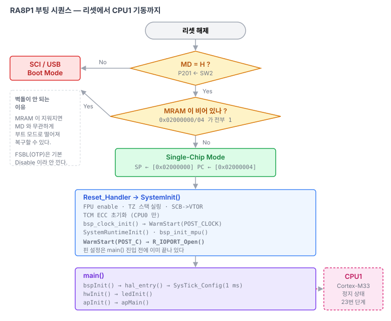

# 01. RA8P1 부팅 시퀀스

> `R7KA8P1KFLCAC` 가 리셋에서 풀린 뒤 CPU0 펌웨어가 돌기까지, 그리고 CPU1 이 깨어나기까지.
> 관련: [02-memory-map.md](02-memory-map.md) · [04-dualcore.md](04-dualcore.md) · [05-boot-architecture.md](05-boot-architecture.md)
>
> 출처: RA8P1 하드웨어 매뉴얼 1장(Overview), 2.9절(CPU_CTRL), 4장(Operating Modes), 60장(MRAM).



---

## 1. STM32N6 식 FSBL 은 필요 없다

STM32N6 는 내부 플래시가 아예 없어서 BootROM 이 외부 저장장치에서 FSBL 을 SRAM 으로 끌어와야 부팅이 시작된다. **RA8P1 은 다르다.** 온칩 MRAM 1 MB 가 있고 리셋 직후 여기서 바로 실행한다.

Single-chip mode 에서 리셋이 풀리면 CPU0 는

1. `0x0200_0000` 에서 초기 스택 포인터를 읽고
2. `0x0200_0004` 에서 시작 주소를 읽어

곧바로 실행한다. 중간 단계가 없다.

**CPU0 의 초기 벡터 주소 `0x0200_0000` 은 하드웨어 고정이다** (매뉴얼 Table 2.6, Primary CPU INITSVTOR). 바꿀 수 없다. 그래서 부트로더를 도입하면 부트로더가 반드시 MRAM 맨 앞을 차지한다([05-boot-architecture.md](05-boot-architecture.md)).

## 2. 동작 모드는 MD 핀 하나로 결정된다

| MD | 모드 | 동작 |
|---|---|---|
| **H** | Single-chip mode (또는 JTAG Boot) | 온칩 MRAM enable, 위 1절대로 실행 |
| **L** | SCI / USB boot mode | 온칩 프로그래밍 루틴 실행 |

이 보드에서 `MD` 는 **P201** 이고 **SW2 (USER/BOOT 버튼)** 에 물려 있다 (R83 47 KΩ / R85 1K5). 즉 SW2 를 누른 채 리셋하면 시리얼/USB 프로그래밍 모드로 들어간다. 공장 초기 프로그래밍 경로다.

### 벽돌이 안 되는 이유

부팅 판정에는 안전장치가 하나 더 있다 (매뉴얼 Figure 4.1).

```
리셋 해제
  └─ MD = H ?
       ├─ No  → SCI / USB Boot Mode
       └─ Yes → 0x0200_0000 / 0x0200_0004 의 64비트가 전부 1 ?
                  ├─ Yes → SCI / USB Boot Mode     ← MRAM 이 비면 자동으로 부트 모드
                  └─ No  → Single-Chip Mode
```

**MRAM 이 지워져 있으면 MD 핀과 무관하게 알아서 부트 모드로 떨어진다.** 잘못된 이미지를 써서 못 살리는 상황이 하드웨어 수준에서 방지된다.

### JTAG Boot Mode

별개의 경로다. `RES` 를 어서트한 상태에서 디버거가 `JBMDR` 에 `0xA5` 를 쓰고, `MD=H` 로 리셋을 풀면 진입한다.

## 3. RA8P1 의 FSBL — 온칩 OTP, 기본은 꺼져 있다

매뉴얼 1장에 "On-chip OTP contains First Stage Bootloader (FSBL)" 이라는 문구가 있다. **이건 Renesas 가 제공하는 온칩 OTP 코드이지 사용자가 MRAM 에 배치하는 것이 아니다.** 용도는 보안 부팅이다.

제어는 OTP 의 `FSBLCTRL0` (`0x02E0_7600`) 에서 한다.

| 필드 | 의미 |
|---|---|
| `FSBLEN[2:0]` | `000b` = Enable, `111b` = Disable |
| `FSBLSKIPSW[2:0]` | 소프트웨어 리셋 시 건너뛰기 |
| `FSBLSKIPDS[2:0]` | Deep SW Standby 리셋 시 건너뛰기 |
| `FSBLCLK[2:0]` | FSBL 실행 중 시스템 클럭 |

**공장 출하 blank 값은 `0xFFFF_FFFF` 이므로 `FSBLEN = 111b` → Disable 이다.** 기본 상태에서 FSBL 은 실행되지 않는다. 게다가 칩 버전 A(production ID 0)는 `FSBLEN = 000b` 설정 자체가 금지다 (매뉴얼 Table 1.1).

두 가지를 더 알아둘 것:

- FSBL 은 **보안 부팅용**이다. OSPI XIP 부팅 선택 같은 용도가 아니다. MRAM 외 부팅 소스 선택은 MD 핀뿐이다.
- **FSBL 실행 중에는 디버그가 금지된다.** 켜기 전에 이 점을 반드시 고려한다.

링커 스크립트에 `OPTION_SETTING_OTP_FSBLCTRL0/1/2` 섹션이 잡혀 있지만 우리는 아무것도 내보내지 않는다. 크기가 `0 B` 로 나오는 게 정상이다.

## 4. 리셋 이후 FSP 가 하는 일

`Reset_Handler` 부터 `main()` 까지는 전부 FSP 코드다. 순서는 `ra/fsp/src/bsp/cmsis/Device/RENESAS/Source/` 의 `startup.c` / `system.c` 에 있다.

```
Reset_Handler                       startup.c
  └─ SystemInit()                   system.c
       ├─ Cortex-M85 캐시/에라타 처리
       ├─ FPU enable (SCB->CPACR)
       ├─ TrustZone 스택 실링
       ├─ SCB->VTOR = &__VECTOR_TABLE
       ├─ TCM ECC 초기화              ← CPU0 만
       ├─ bsp_clock_init()
       ├─ R_BSP_WarmStart(POST_CLOCK)
       ├─ 스택 포인터 모니터
       ├─ SystemRuntimeInit()         ← 링커 생성 테이블 기반 .data/.bss 초기화
       ├─ SystemCoreClockUpdate()
       ├─ bsp_init_mpu()
       └─ R_BSP_WarmStart(POST_C)     ← 여기서 R_IOPORT_Open() 으로 핀 설정
  └─ main()
```

`R_BSP_WarmStart` 는 세 시점(`RESET` / `POST_CLOCK` / `POST_C`)에 불리는 weak 훅이다. 이 프로젝트는 `src/lib/ra_sdk/cm85/src/hal_warmstart.c` 에서 이를 구현하고, `POST_C` 시점에 `R_IOPORT_Open()` 을 부른다.

**즉 `main()` 에 들어올 때 핀 설정은 이미 끝나 있다.** `ledInit()` 이 방향을 잡지 않고 `ledOff()` 만 부르는 이유다.

## 5. 이 프로젝트의 진입 흐름

```
main()                    src/cpu/cm85/main.c
  ├─ bspInit()            src/cpu/cm85/bsp/bsp.c
  │    ├─ (캐시는 _USE_HW_CACHE 로 잠가둠)
  │    ├─ hal_entry()     src/lib/ra_sdk/cm85/src/hal_entry.c  — 현재 비어 있음
  │    └─ SysTick_Config(SystemCoreClock / 1000)
  ├─ hwInit()             src/cpu/cm85/hw/hw.c   — ledInit()
  ├─ apInit()             src/cpu/cm85/ap/ap.c
  └─ apMain()             500 ms LED 토글
```

`hal_entry()` 는 FSP 가 정의한 진입점이라 이름을 유지한다. 지금은 비어 있지만, CPU1 을 기동하는 `R_BSP_SecondaryCoreStart()` 호출이 들어갈 자리가 여기다([04-dualcore.md](04-dualcore.md)).

## 6. CPU1 (Cortex-M33) 기동

CPU1 은 리셋 후 **정지 상태**로 남는다. CPU0 가 명시적으로 깨워야 한다.

```c
R_CPU_CTRL->CPU1INITVTOR = (uint32_t) BSP_PARTITION_FLASH_CPU1_S_START;
R_CPU_CTRL->CPU1WAITCR   = 0;
R_CPU_CTRL->CPU1ACTCSR   = (0xA5 << KEY_Pos) | ACTREQ_Msk;
```

- `CPU_CTRL` 베이스는 `0x4000_F000` (비보안 별칭 `0x5000_F000`)
- **`CPU1INITVTOR` 는 하위 7비트가 버려진다** → CPU1 벡터 테이블은 **128 바이트 정렬 필수** (매뉴얼 2.9.1.7)
- `CPU1WAITCR = 0` 은 디버거가 CPU1 을 미리 붙잡아 둔 경우를 풀어주는 것이다

세부는 [04-dualcore.md](04-dualcore.md) 에 있다.

> ### 부작용 하나 — pyOCD 경고
>
> CPU1 이 정지 상태라 디버거가 그쪽 AP 에 접근하지 못한다. `pyocd` 로 붙으면 이런 경고가 뜬다.
>
> ```
> Error probing AP#2: SWD/JTAG communication failure (WAIT ACK)
> Invalid coresight component, cidr=0x5900d00
> ```
>
> DFP 에 CPU0(Cortex-M85) / CPU1(Cortex-M33) 두 프로세서가 선언돼 있어 코어 AP 가 최소 둘이고,
> AP#2 가 아직 안 깨어난 CPU1 로 보인다. 동작에는 지장이 없다.
