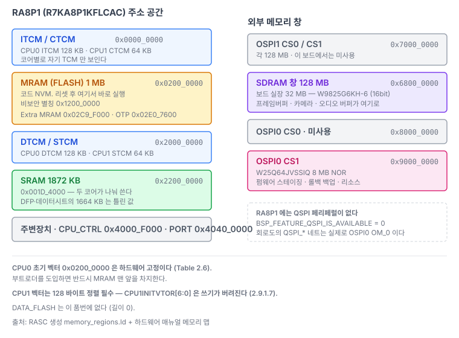
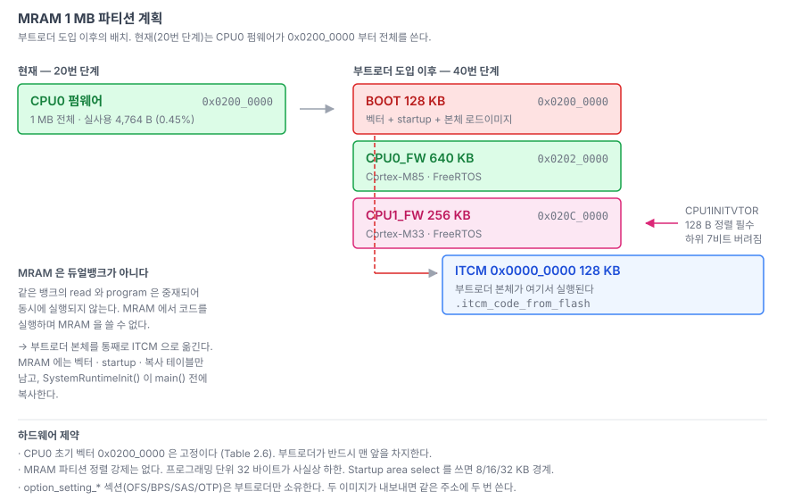
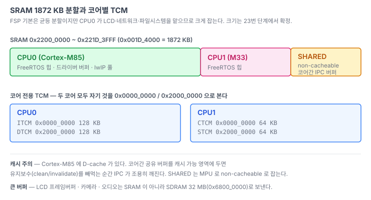

# 02. RA8P1 메모리 맵

> `R7KA8P1KFLCAC` 의 주소 공간과, 부트로더 / CPU0 / CPU1 이 MRAM·SRAM 을 나눠 쓰는 방법.
> 관련: [01-boot-sequence.md](01-boot-sequence.md) · [04-dualcore.md](04-dualcore.md) · [05-boot-architecture.md](05-boot-architecture.md)
>
> 값의 출처는 RASC 가 생성한 `memory_regions.ld` 와 하드웨어 매뉴얼 메모리 맵이다.
> 저장소 안의 실제 파일은 `firmware/ra8p1-fw/src/lib/ra_sdk/cm85/memory_regions.ld` 다.



---

## 1. 전체 주소 공간

| 영역 | 시작 | 크기 | 비고 |
|---|---|---|---|
| **ITCM** (CPU0) | `0x0000_0000` | `0x0002_0000` (128 KB) | Cortex-M85 명령 TCM |
| **CTCM** (CPU1) | `0x0000_0000` | `0x0001_0000` (64 KB) | Cortex-M33 쪽. 코어별로 자기 TCM 만 보인다 |
| **MRAM (FLASH)** | `0x0200_0000` | `0x0010_0000` (1 MB) | 보안 별칭. 코드 NVM |
| MRAM 비보안 별칭 | `0x1200_0000` | 〃 | 같은 물리 메모리 |
| Extra MRAM (옵션 설정) | `0x02C9_F000` 대역 | — | OFS0/1/2/3, BPS, SAS |
| OTP | `0x02E0_7600` 대역 | — | FSBLCTRL, SACC, PBPS, ZHUK |
| **DTCM** (CPU0) | `0x2000_0000` | `0x0002_0000` (128 KB) | |
| **STCM** (CPU1) | `0x2000_0000` | `0x0001_0000` (64 KB) | |
| **SRAM** | `0x2200_0000` | `0x001D_4000` (**1872 KB**) | 두 코어가 공유하는 주 메모리 |
| DATA_FLASH | `0x2700_0000` | `0` | 이 품번에는 없다 |
| **OSPI1 CS0** | `0x7000_0000` | `0x0800_0000` | |
| OSPI1 CS1 | `0x7800_0000` | `0x0800_0000` | |
| **SDRAM** | `0x6800_0000` | `0x0800_0000` (128 MB 창) | 보드 실장은 **32 MB** (W9825G6KH-6) |
| OSPI0 CS0 | `0x8000_0000` | `0x1000_0000` | |
| **OSPI0 CS1** | `0x9000_0000` | `0x1000_0000` | **보드의 W25Q64 8 MB 가 여기** ([03](03-board-mapping.md#5-외부-메모리)) |
| CPU_CTRL | `0x4000_F000` | — | 비보안 별칭 `0x5000_F000` |
| I/O PORT | `0x4040_0000` | — | PORT1 은 `0x4040_0020` |

## 2. SRAM 크기 — 세 군데가 서로 다르다

| 출처 | 값 |
|---|---|
| DFP pdsc | `0x1A_0000` (1664 KB) |
| 데이터시트 | "1664 KB user SRAM" |
| **RASC `memory_regions.ld`** | **`0x1D_4000` (1872 KB)** |

**RASC 값이 맞다.** 하드웨어 매뉴얼 메모리 맵으로 확인했다.

```
0x2200_0000 ~ 0x2219_FFFF   S0BI/S1BI/S2BI/S3BI   1664 KB
0x221A_0000 ~ 0x221D_3FFF   S0BI/S1BI/S2BI/S3BI    208 KB
```

연속이고 구멍이 없다. 합계 `0x1D_4000` = 1872 KB. DFP 와 데이터시트가 뒤쪽 208 KB 를 빼고 센 것이다. **링커 스크립트에는 `0x1D_4000` 을 쓴다.**

## 3. MRAM 특성

부트로더를 만들 때 전제가 되는 값들이다.

| 항목 | 값 |
|---|---|
| 사용자 영역 | 1 MB, `0x0200_0000`(S) / `0x1200_0000`(NS) |
| 프로그래밍 단위 | 1 ~ 32 바이트 (write page buffer). **FSP 는 32 사용** (`BSP_FEATURE_MRAM_PROGRAMMING_SIZE_BYTES`) |
| Extra MRAM | 16 바이트 단위, MACI 커맨드 |
| Dual bank | **없음** |
| Block swap | **없음** |
| ECC | double-bit 정정 / triple-bit 검출 |
| Startup area select | 8 / 16 / 32 KB 중 선택 — 시작 프로그램 안전 업데이트용 |
| 블록 보호 | `MRCPC0` / `MRCPC1`, permanent block protect, `FSPR` 로 `BTFLG`/`BTSIZE`/`MSUACR` 보호 |
| FSP 드라이버 | `r_mram` — `R_MRAM_Open/Write/Erase/BlankCheck`, `g_flash_on_mram` (`flash_api_t`) |

> ### 함정 — RWW(Read-While-Write) 는 뱅크가 갈릴 때만 된다
>
> 매뉴얼 60.13.2 (Parallel Accessibility):
>
> - BGO 는 **서로 다른 MRAM 뱅크 사이에서만** 가능하다.
> - **같은 MRAM 매크로에 대한 read 와 program 은 중재되어 동시에 실행되지 않는다.**
> - 코드 MRAM ↔ Extra MRAM(옵션 영역) 사이는 서로 read/program 이 된다.
> - 프로그래밍 중 인터럽트/예외가 걸리면 코드 MRAM 에서 벡터를 못 읽는다. 매뉴얼 권고는
>   "벡터 주소를 코드 MRAM 밖으로 옮기거나, 프로그래밍 중에는 인터럽트/예외 처리를 하지 말 것" 이다.
>
> → 부트로더가 자기와 같은 뱅크를 쓰려면 **쓰기 루틴과 벡터 테이블을 ITCM/SRAM 으로 옮겨 실행**해야 한다.
>
> 참고로 FSP 의 `r_mram.c` 는 `r_flash_hp` 와 달리 `PLACE_IN_RAM_SECTION` 을 하나도 쓰지 않는다.
> 뱅크가 나뉘어 BGO 가 되는 것을 전제한 것으로 보이는데, 실제 배치에서 검증이 필요하다.
> 40번(부트로더) 단계의 선결 과제다.

그 밖의 제약:

- 프로그래밍 중 주파수 변경 / software standby / deep standby 전환 금지.
- 코드 MRAM 쓰기 후 배리어 + flush + 완료 대기 시퀀스가 필요하다. CPU 스톨을 피하려면 dummy read 대신 `MRCPS.PRGBSYC` 를 폴링한다.
- ECC 를 쓰는 OTP 영역은 서로 다른 데이터로 두 번 프로그래밍할 수 없다.

## 4. MRAM 파티션 계획



부트로더를 도입한 뒤의 배치다. **현재(20번 단계)는 부트로더가 없어 CPU0 펌웨어가 `0x0200_0000` 부터 1 MB 전체를 쓴다.**

| 영역 | 시작 | 크기 | 내용 |
|---|---|---|---|
| BOOT | `0x0200_0000` | 128 KB | 부트로더 (CPU0). 벡터 + `.version` + 코드. **CPU0 초기 벡터가 하드웨어 고정이라 반드시 맨 앞** |
| CPU0_FW | `0x0202_0000` | 640 KB | CPU0 펌웨어 |
| CPU1_FW | `0x020C_0000` | 256 KB | CPU1 펌웨어. `CPU1INITVTOR` 가 여기를 가리킨다 |

**정렬 제약**

- CPU0 초기 벡터 `0x0200_0000` 은 하드웨어 고정이다.
- **CPU1 벡터 테이블은 128 바이트 정렬 필수** — `CPU1INITVTOR[6:0]` 은 쓰기가 버려진다.
- MRAM 자체의 파티션 경계 정렬 강제는 없다. 프로그래밍 단위 32 바이트가 사실상 하한이다.
- Startup area select(8/16/32 KB)를 쓸 거면 그 경계에 맞춘다.

위 크기는 아직 초안이다. 각 이미지의 실제 크기가 나오는 40번 단계에서 확정한다.

## 5. SRAM 파티션 계획



FSP 기본은 균등 분할이지만 이 프로젝트는 CPU0 쪽을 크게 잡는다. CPU0 가 LCD 프레임버퍼·네트워크·파일시스템을 담당하기 때문이다. 코어간 공유 버퍼는 **non-cacheable 로 잡은 별도 구간**에 둔다 — Cortex-M85 에 D-cache 가 있어서 캐시 유지보수를 빼먹으면 IPC 가 조용히 깨진다([04-dualcore.md](04-dualcore.md)).

여기에 더해 CPU0 는 ITCM/DTCM 각 128 KB, CPU1 은 CTCM/STCM 각 64 KB 를 따로 갖는다. 두 코어 모두 자기 TCM 을 `0x0000_0000` / `0x2000_0000` 으로 본다.

큰 버퍼(LCD 프레임버퍼, 카메라, 오디오)는 SRAM 이 아니라 **SDRAM 32 MB** 로 보낸다(27번 단계).

## 6. 파티션을 링커에 알리는 방법

RA8P1 의 듀얼코어 지원은 `bsp_common.h` 의 이 판정에 걸려 있다.

```c
/* Used to determine if this project is part of a multicore FSP Solution. */
#if defined(BSP_PARTITION_FLASH_CPU1_S_START)
 #define BSP_MULTICORE_PROJECT    (1)
#else
 #define BSP_MULTICORE_PROJECT    (0)
#endif
```

이 매크로들은 `bsp_linker_info.h` 의 `/******* Solution Definitions *******/` 블록에 들어간다. 심볼 이름 규칙은 RASC 의 freemarker 템플릿(`Renesas##BSP##ra8p1##linker####6.6.0.xml`) 원문 기준으로 이렇다.

```
BSP_PARTITION_<RESOURCE>_<CPU0|CPU1>_<S|NS>_START
BSP_PARTITION_<RESOURCE>_<CPU0|CPU1>_<S|NS>_SIZE
```

- `RESOURCE` : `FLASH` / `RAM` / `ITCM` / `DTCM` / `CTCM` / `STCM` / `SDRAM` / `OSPI0_CS0` …
- `OPTION` 이 들어간 resource 는 통째로 스킵된다
- `partition.userDefined` 가 있으면 그 값을 대문자로 그대로 쓴다

> ### 현재 상태 — 이 매크로들이 아직 없다
>
> `memories` 는 **RASC Solution 프로젝트의 파티션 데이터에서만** 채워진다. 단일 프로젝트로 생성하면
> 블록이 통째로 사라져서 `BSP_MULTICORE_PROJECT = 0` 이 되고, `R_BSP_SecondaryCoreStart()` 자체가
> 컴파일되지 않는다.
>
> 그런데 **standalone RASC 로는 Solution 을 헤드리스 생성할 수 없다.** `--generatesolution` 옵션이
> 있지만 no-op 이다 (`multi_flat_blinky` 같은 멀티코어 템플릿이 필터링돼 노출되지 않고,
> 유효 인자를 다 채워도 출력 디렉터리가 빈 채로 끝난다). Solution 생성은 e2 studio GUI 전용으로 보인다.
>
> **그래서 이 프로젝트는 파티션을 직접 정의한다.** 23번 단계에서
> `memory_regions.ld` 의 FLASH/RAM 범위를 코어별로 좁히고, `bsp_linker_info.h` 의 Solution Definitions
> 자리에 위 이름 규칙대로 `#define` 을 넣는다. 위 규칙은 템플릿 원문에서 읽어낸 것이라 정식 형식과 같다.

## 7. 옵션 설정 영역은 1차 이미지만 소유한다

`option_setting_*` 섹션(OFS0/1/2/3, BPS, SAS, OTP)은 부팅 시 한 번만 의미가 있다. **두 이미지가 모두 내보내면 같은 주소에 두 번 쓰게 된다.**

- **부트로더가 소유한다.**
- 애플리케이션 프로젝트에서는 링커에서 해당 섹션을 비우거나 제외한다.

현재는 부트로더가 없고 CPU0 펌웨어도 이 섹션에 아무것도 넣지 않는다. 빌드 출력에서 전부 `0 B` 로 나오는 게 정상이다.

```
OPTION_SETTING_OFS0:           0 B          4 B      0.00%
OPTION_SETTING_OTP_FSBLCTRL0:  0 B          4 B      0.00%
...
```
