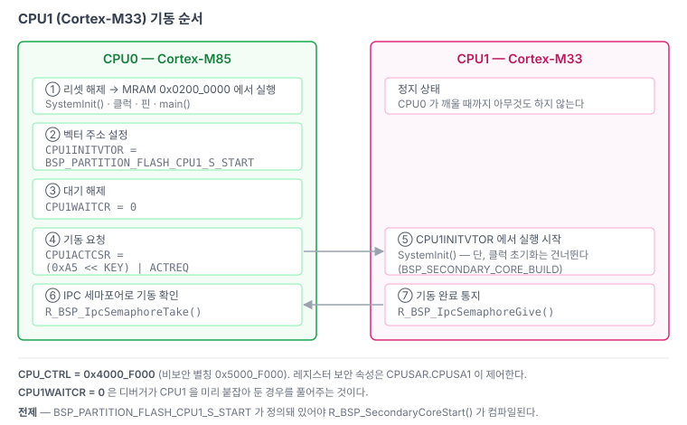

# 04. 듀얼코어 — CPU1 기동과 코어간 통신

> Cortex-M85(CPU0)가 Cortex-M33(CPU1)을 깨우는 방법, 메모리 파티션을 링커에 알리는 방법,
> 그리고 D-cache 때문에 반드시 지켜야 하는 규칙.
> 관련: [01-boot-sequence.md](01-boot-sequence.md) · [02-memory-map.md](02-memory-map.md)
>
> **상태: 설계만 확정. 구현은 23번 단계다.** 현재 `src/cpu/cm33/` 은 스켈레톤이고 `BUILD_CM33=OFF` 다.



---

## 1. 기동 시퀀스

CPU1 은 리셋 후 정지 상태로 남는다. CPU0 가 `CPU_CTRL`(`0x4000_F000`, 비보안 별칭 `0x5000_F000`) 레지스터 세 개를 써서 깨운다. FSP 가 `bsp_common.h` 에 인라인 함수로 제공한다.

```c
__STATIC_INLINE void R_BSP_SecondaryCoreStart (void)
{
    /* Setup secondary CPU vector table */
    R_CPU_CTRL->CPU1INITVTOR = (uint32_t) BSP_PARTITION_FLASH_CPU1_S_START;

    /* When debugging multicore projects, CPU1 may already be activated by the debugger with
     * CPU1WAITCR set to 1. ... */
    R_CPU_CTRL->CPU1WAITCR = 0;

    /* Activate secondary CPU by setting key code and activation request in CPU1ACTCSR */
    R_CPU_CTRL->CPU1ACTCSR = (0xA5 << R_CPU_CTRL_CPU1ACTCSR_KEY_Pos) |
                             R_CPU_CTRL_CPU1ACTCSR_ACTREQ_Msk;
}
```

호출 위치는 `hal_entry()` 다 (`src/lib/ra_sdk/cm85/src/hal_entry.c`).

> ### 정렬 제약 — 128 바이트
>
> `CPU1INITVTOR[6:0]` 은 **쓰기가 버려지고 0 으로 읽힌다** (매뉴얼 2.9.1.7).
> CPU1 파티션의 시작 주소는 반드시 128 바이트 정렬이어야 한다.
> `0x020C_0000` 은 조건을 만족한다.

`CPU1WAITCR = 0` 은 디버거가 CPU1 을 미리 붙잡아 둔 경우를 풀어주는 것이다. 디버거는 CPU0 가 깨우기 전에 CPU1 에 붙기 위해 이 비트를 1 로 세워 둘 수 있다.

레지스터의 보안 속성은 `CPUSAR.CPUSA1` 이 제어한다.

## 2. CPU1 쪽 초기화의 차이

FSP 는 `BSP_SECONDARY_CORE_BUILD` 로 분기한다. 주요 차이는 이렇다.

| 항목 | CPU0 | CPU1 |
|---|---|---|
| 클럭 초기화 | `bsp_clock_init()` 수행 | **건너뜀** — CPU0 가 설정한 것을 그대로 쓴다 |
| TCM ECC 초기화 | 수행 | 건너뜀 |
| SAU 설정 | 일반 경로 | 더 이른 시점에 수행 (CPU0 가 이미 SAR 을 잡았으므로) |
| 보안 레지스터 | 대입 (`=`) | **AND** (`&=`) — CPU0 설정을 덮지 않는다 |
| 핀 보안 (`PMSAR`) | 대입 | AND |
| TCM | ITCM/DTCM 각 128 KB | CTCM/STCM 각 64 KB |

`pin_data.c` 의 이 부분이 대표적이다.

```c
#if BSP_SECONDARY_CORE_BUILD
    R_PMISC->PMSAR[i].PMSAR &= (uint16_t) pmsar[i];   // AND — core 0 설정을 보존
#else
    R_PMISC->PMSAR[i].PMSAR = (uint16_t) pmsar[i];
#endif
```

**핀 소유권은 CPU0 가 정한다.** CPU1 이 쓰는 페리페럴의 핀도 CPU0 의 `pin_data.c` 에 들어가야 한다.

## 3. 파티션 매크로를 직접 정의해야 한다

RA8P1 의 듀얼코어 지원 전체가 이 판정 하나에 걸려 있다 (`bsp_common.h:207`).

```c
#if defined(BSP_PARTITION_FLASH_CPU1_S_START)
 #define BSP_MULTICORE_PROJECT    (1)
#else
 #define BSP_MULTICORE_PROJECT    (0)
#endif
```

그리고 `R_BSP_SecondaryCoreStart()` 자체가 이 조건 안에 있다.

```c
#if BSP_FEATURE_CGC_SCKDIVCR2_HAS_EXTRA_CLOCKS && !BSP_SECONDARY_CORE_BUILD \
    && defined(BSP_PARTITION_FLASH_CPU1_S_START)
```

즉 매크로가 없으면 **함수가 아예 컴파일되지 않는다.**

### 왜 매크로가 없나

이 매크로들은 `bsp_linker_info.h` 의 `/******* Solution Definitions *******/` 블록에 들어간다. 그런데 그 블록을 채우는 `memories` 데이터는 **RASC Solution 프로젝트에서만** 생성된다. 단일 프로젝트로 뽑으면 블록이 통째로 비어 있다.

그리고 **standalone RASC 로는 Solution 을 헤드리스 생성할 수 없다.**

- `--generatesolution` 옵션은 있지만 no-op 이다.
- `--fspversion 6.6.0` 을 줘도 `single_*_minimal` 계열 6개만 노출되고 `multi_flat_blinky` 같은 멀티코어 템플릿은 필터링돼 사라진다.
- 유효 인자를 다 채워도 로그에 `Solution generation` 한 줄만 찍히고 출력 디렉터리가 빈 채로 끝난다. `--toolchainid` 에 쓰레기값을 넣어도 에러가 안 난다 — 검증 자체를 하지 않는다.

Solution 생성은 e2 studio GUI 전용으로 보인다.

### 그래서 직접 정의한다

이름 규칙은 RASC 의 freemarker 템플릿 원문에서 읽어냈다 (`device/ra8p1_mcu/.module_descriptions/Renesas##BSP##ra8p1##linker####6.6.0.xml`). 확장자가 `.ftl` 이 아니라 module description XML 안에 임베드돼 있다.

```
#define BSP_PARTITION_<RESOURCE>_<CPU0|CPU1>_<S|NS>_START (<시작>)
#define BSP_PARTITION_<RESOURCE>_<CPU0|CPU1>_<S|NS>_SIZE  (<크기>)
```

- `RESOURCE` : `FLASH` / `RAM` / `ITCM` / `DTCM` / `CTCM` / `STCM` / `SDRAM` / `OSPI0_CS0` …
  (`_NS` 접미사는 정규식으로 제거된다)
- `core` 가 `CM` 으로 시작하면 `CPU0` 으로 치환, 아니면 그대로
- `security` 가 있으면 `_` + 대문자 (`S` / `NS`)
- `OPTION` 이 들어간 resource 는 통째로 스킵
- `partition.userDefined` 가 있으면 그 값을 대문자로 그대로 쓴다 (나머지 규칙 무시)

23번 단계에서 할 일은 두 가지다.

1. `memory_regions.ld` 의 `FLASH_START/LENGTH`, `RAM_START/LENGTH` 를 코어별 파티션으로 좁힌다.
   현재는 두 코어 모두 전체 영역(`0x0200_0000`/1 MB, `0x2200_0000`/`0x1D_4000`)을 선언한다.
2. 두 코어의 `bsp_linker_info.h` 의 Solution Definitions 자리에 위 규칙대로 `#define` 을 넣는다.

`R_BSP_SecondaryCoreStart()` 의 내용은 레지스터 세 개 쓰기뿐이라, 정 안 되면 직접 써도 된다.

## 4. IPC — 하드웨어 세마포어

FSP 가 `bsp_ipc.c` / `bsp_ipc.h` 로 하드웨어 IPC 세마포어를 제공한다.

```c
bsp_ipc_semaphore_handle_t g_core_start_semaphore = { .semaphore_num = 0 };

R_BSP_IpcSemaphoreTake(&g_core_start_semaphore);
R_BSP_IpcSemaphoreGive(&g_core_start_semaphore);
```

FSP 의 `hal_entry.c` 템플릿이 이걸 기동 확인용으로 쓴다. CPU0 가 세마포어를 먼저 가져간 뒤 CPU1 을 깨우고, CPU1 이 부팅을 마치면 세마포어를 놓아 CPU0 에 알린다.

## 5. D-cache — 이걸 빼먹으면 조용히 깨진다


Cortex-M85 에는 D-cache 가 있다. **코어간 공유 버퍼를 캐시 가능 영역에 두면, 유지보수를 한 번만 빼먹어도 상대 코어가 낡은 데이터를 본다.** 증상이 산발적이라 디버깅이 아주 어렵다.

규칙은 이렇게 간다.

1. **공유 버퍼는 non-cacheable 영역에 둔다.** SRAM 끝에 별도 구간을 잡고 MPU 로 non-cacheable 로 설정한다. FSP 의 링커 생성물에 `__nocache$$` 심볼과 `bsp_mpu_nocache_info_t` 구조체가 이미 있다.
2. 부득이하게 캐시 가능 영역을 공유해야 하면, 쓰는 쪽이 `SCB_CleanDCache_by_Addr()`, 읽는 쪽이 `SCB_InvalidateDCache_by_Addr()` 를 부른다. 주소와 크기를 캐시 라인(32 B) 경계에 맞춰야 한다.
3. 공유 구조체에 코어별 전용 필드를 섞지 않는다. 같은 캐시 라인에 걸리면 false sharing 으로 서로의 쓰기를 날린다.

현재 `bspInit()` 은 캐시를 **켜지 않는다**. `_USE_HW_CACHE` 스위치로 막아 뒀다.

```c
#ifdef _USE_HW_CACHE
SCB_EnableICache();
SCB_EnableDCache();
#endif
```

SDRAM · DMA · 코어간 공유 버퍼를 쓰기 시작하는 시점(27번 단계 전후)에 규칙을 먼저 세우고 켠다.

## 6. FreeRTOS 와의 관계

두 코어가 **각자 독립된 FreeRTOS 인스턴스**를 돌린다. 하나의 스케줄러가 두 코어를 관리하는 SMP 구성이 아니다.

- 포트 레이어는 FSP 가 제공하는 `ra/fsp/src/rm_freertos_port/` 를 쓴다. 직접 포팅하지 않는다.
- 코어간 통신에 FreeRTOS 큐를 쓸 수 없다. IPC 세마포어 + non-cacheable 공유 버퍼로 직접 만든다.
- 22번(FreeRTOS)을 23번(CM33)보다 먼저 하는 이유가 이것이다. 코어별 RTOS 구성이 자리를 잡은 뒤에 두 번째 코어를 올린다.

## 7. 디버깅 시 알아둘 것

`pyocd` 로 붙으면 이런 경고가 나온다.

```
Error probing AP#2: SWD/JTAG communication failure (WAIT ACK)
Invalid coresight component, cidr=0x5900d00
```

DFP pdsc 에 `CPU0`(Cortex-M85)과 `CPU1`(Cortex-M33) 두 프로세서가 선언돼 있어 코어 AP 가 최소 둘이다. **CPU1 은 `CPU1ACTCSR` 를 쓰기 전까지 정지 상태라 응답이 없는 게 정상이다.** 동작에는 지장이 없다.

`cidr=0x5900d00` 경고는 ROM 테이블 파싱 쪽이라 같은 원인인지는 확실하지 않다. 역시 무해하다.
