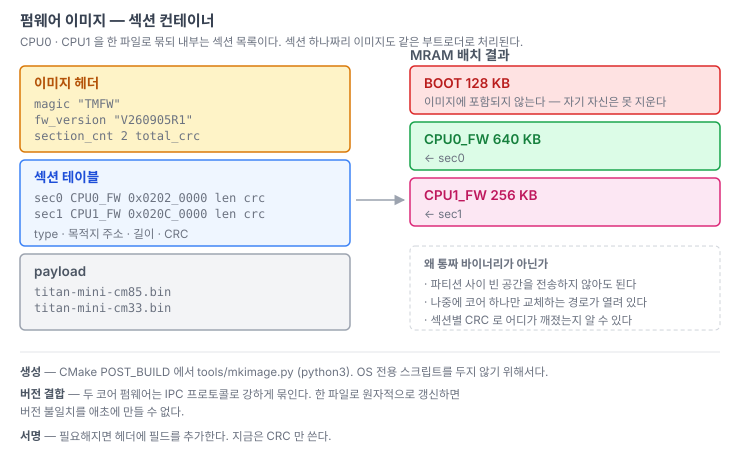
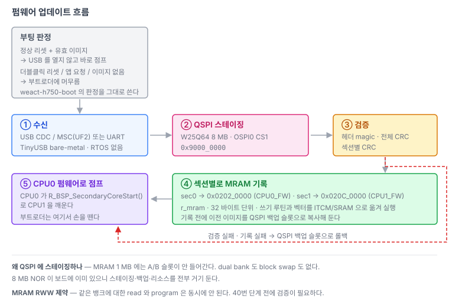

# 05. 부트로더 / 펌웨어 구조

> 부트로더와 펌웨어를 어떻게 나누고, 두 코어의 이미지를 어떻게 한 덩어리로 관리하는지.
> 관련: [01-boot-sequence.md](01-boot-sequence.md) · [02-memory-map.md](02-memory-map.md) · [04-dualcore.md](04-dualcore.md)
>
> **상태: 설계만 확정. 구현은 40 · 41번 단계다.** MRAM · OSPI · USB 드라이버가 갖춰진 뒤에 만든다.
> 지금 이 문서를 먼저 쓰는 이유는 **MRAM 배치를 미리 확정해야** 나중에 펌웨어 시작 주소를
> 옮기는 일이 한 번으로 끝나기 때문이다.

---

## 1. 2단 구조 — FSBL 은 없다

```
[리셋] → MRAM 0x0200_0000  부트로더 (CPU0, RTOS 없음)
       → MRAM 0x0202_0000  CPU0 펌웨어 (FreeRTOS)
       → R_BSP_SecondaryCoreStart()
       → MRAM 0x020C_0000  CPU1 펌웨어 (FreeRTOS)
```

STM32N6 식 FSBL 단계는 없다. RA8P1 은 내부 MRAM 에서 바로 실행하기 때문이다([01](01-boot-sequence.md#1-stm32n6-식-fsbl-은-필요-없다)). RA8P1 에도 FSBL 이 있긴 하지만 **온칩 OTP 코드이고 공장 출하 상태에서는 Disable** 이다.

**CPU0 의 초기 벡터 `0x0200_0000` 은 하드웨어 고정이므로 부트로더가 반드시 MRAM 맨 앞을 차지한다.**

공장 초기 프로그래밍은 SWD(pyOCD) 또는 SW2(`P201/MD`)를 누른 채 리셋해서 들어가는 SCI/USB 부트 모드를 쓴다.

## 2. 펌웨어 이미지 — 섹션 컨테이너



CPU0 · CPU1 을 한 파일로 묶되 내부는 섹션 목록으로 둔다.

```
titan-mini.fw
┌──────────────────────────────┐
│ magic "TMFW"                 │
│ fw_version  "V260905R1"      │
│ section_cnt 2   total_crc    │
├──────────────────────────────┤
│ sec0  CPU0_FW  0x02020000    │
│ sec1  CPU1_FW  0x020C0000    │
├──────────────────────────────┤
│ titan-mini-cm85.bin          │
│ titan-mini-cm33.bin          │
└──────────────────────────────┘
```

**왜 통짜 바이너리가 아닌가**

- 파티션 사이의 빈 공간을 전송하지 않아도 된다.
- 나중에 코어 하나만 교체하는 경로가 열려 있다 — 섹션 하나짜리 이미지를 **같은 부트로더로** 처리할 수 있다.
- 섹션별 CRC 로 어디가 깨졌는지 알 수 있다.

**왜 코어별 파일 두 개가 아닌가**

두 코어 펌웨어는 IPC 프로토콜로 강하게 묶인다. 한 파일로 원자적으로 갱신하면 **버전 불일치를 애초에 만들 수 없다.** 슬롯 두 개를 따로 관리하면 호환성 매트릭스와 프로토콜 버전 체크 로직을 직접 유지해야 한다.

이미지 생성은 CMake POST_BUILD 에서 `tools/mkimage.py`(python3)로 한다. `.sh`/`.bat` 를 두지 않는 이유는 Windows/Linux/macOS 에서 같은 명령으로 돌리기 위해서다.

서명이 필요해지면 헤더에 필드를 추가한다. 지금은 CRC 만 쓴다.

## 3. 업데이트 흐름



| 단계 | 내용 |
|---|---|
| ① 수신 | USB CDC / MSC(UF2) 또는 UART |
| ② 스테이징 | **OSPI0 CS1 의 W25Q64 8 MB** (`0x9000_0000`) 에 통째로 받아 둔다 |
| ③ 검증 | 헤더 magic · 전체 CRC · 섹션별 CRC |
| ④ 기록 | 섹션별로 MRAM 에 쓴다. **ITCM 에서 실행하며 인터럽트를 끈다**(6장). 그 전에 이전 이미지를 QSPI 백업 슬롯으로 복사 |
| ⑤ 점프 | CPU0 펌웨어로 넘어가고, CPU0 가 CPU1 을 깨운다 |

검증이나 기록이 실패하면 QSPI 백업 슬롯에서 롤백한다.

**왜 QSPI 에 스테이징하나** — MRAM 1 MB 에는 A/B 슬롯이 안 들어간다. dual bank 도 block swap 도 없다. 8 MB NOR 이 보드에 이미 있으니 스테이징 · 백업 · 리소스를 전부 거기 둔다.

> ### MRAM 을 쓰는 코드는 MRAM 에서 실행할 수 없다
>
> RA8P1 의 MRAM 은 **뱅크가 하나뿐이라 BGO 가 불가능하다.** 같은 뱅크의 read 와 program 은
> 중재되어 동시에 실행되지 않으므로, MRAM 에서 코드를 실행하면서 MRAM 을 쓰면 명령 인출이
> 막혀 폴링 루프 자체가 멈춘다([02-memory-map.md](02-memory-map.md#3-mram-특성)).
>
> **→ 부트로더 본체를 통째로 ITCM 에서 실행한다.** 아래 6장.

## 4. 옵션 설정 영역은 부트로더가 소유한다

`option_setting_*` 섹션(OFS0/1/2/3, BPS, SAS, OTP)은 부팅 시 한 번만 의미가 있다. 두 이미지가 모두 내보내면 같은 주소에 두 번 쓰게 된다.

- **부트로더가 소유한다.**
- 애플리케이션(CPU0/CPU1) 링커에서는 해당 섹션을 비우거나 제외한다.

## 5. 부트로더는 RTOS 없이 USB 를 쓴다

이미 검증된 패턴이 있다. `weact-h750-mini/firmware/weact-h750-boot`(2026-08-30)를 그대로 이식한다.

- `CFG_TUSB_OS = OPT_OS_NONE` — **TinyUSB bare-metal**. `src/bsp/` 에 `rtos/` 폴더가 없다
- CDC + MSC(UF2 드래그앤드롭) + HID
- `_USE_HW_QSPI` 로 외부 플래시를 이미 쓰고 있다
- 링커에 `VECTOR` / `VER`(`.version` 섹션) / `FLASH` 를 분리해 둔다 — 기존 `firm_ver_t` 규약과 맞는다

### 부팅 판정

`weact-h750-boot` 의 `bootUp()` 이 정리해 둔 규칙을 그대로 쓴다.

| 상황 | 동작 |
|---|---|
| 정상 리셋 + 유효한 이미지 | **USB 를 열지 않고 바로 점프** |
| 더블클릭 리셋 | 부트로더에 머무르고 MSC(UF2)까지 연다 |
| 앱이 요청 (`MODE_BIT_BOOT`) | 머무른다. MSC 를 열지는 앱이 고른다 |
| 유효한 이미지 없음 | 머무르고 MSC 도 연다 — 복구 수단이 있어야 한다 |

정상 부팅에서 USB 를 아예 열지 않는 것이 핵심이다. 그래야 매 부팅마다 호스트에 장치가 나타났다 사라지지 않는다.

> RA8P1 의 USB 에 TinyUSB 포팅이 있는지는 35번 단계에서 판정한다.
> 없으면 FSP 의 `r_usb_basic` + PCDC/PMSC 로 가고, UF2 경로는 그때 재설계한다.

## 6. 부트로더는 ITCM 에서 실행한다

MRAM 이 듀얼뱅크가 아니므로, MRAM 을 쓰는 코드는 MRAM 밖에서 돌아야 한다.
쓰기 함수만 골라서 재배치하는 방법도 있지만 **본체를 통째로 옮기는 쪽을 택한다.**

- 어느 함수가 MRAM 을 건드리는지 일일이 감사할 필요가 없다. 콜 그래프가 라이브러리
  안쪽까지 들어가면 감사가 실질적으로 불가능하다.
- TinyUSB 의 ISR 과 콜백까지 RAM 에 있으므로, 기록 중 인터럽트를 살려 둘 여지가 생긴다.
- SRAM 이 1872 KB, ITCM 이 128 KB 다. 128 KB 부트로더를 옮기는 데 아무 부담이 없다.
- 부트로더는 펌웨어로 넘어가기 전에 손을 떼므로 ITCM 을 점유해도 충돌이 없다.

### 배치

```
MRAM 0x0200_0000   벡터 테이블 + startup/system + 복사 테이블 + 본체 로드이미지
ITCM 0x0000_0000   부트로더 본체 (실행)            128 KB
SRAM 0x2200_0000   다운로드 버퍼 · 스택 · 힙
```

MRAM 에 남는 것은 리셋 직후 실행되는 최소한이다. CPU0 초기 벡터 `0x0200_0000` 이 하드웨어
고정이라 벡터와 startup 은 옮길 수 없다. 하지만 이 코드들은 **부팅 시에만 돌고 MRAM 을 쓰지
않으므로** 문제가 없다.

### FSP 링커가 이미 해 준다

별도의 부팅 스텁을 만들 필요가 없다. `fsp_gen.ld` 에 재배치 섹션이 있고,
`SystemInit()` 안의 `SystemRuntimeInit()` 이 `bsp_init_copy_info_t` 테이블을 따라
`main()` 전에 복사를 끝낸다. `.data` 를 복사하는 것과 같은 메커니즘이다.

```
__itcm_from_flash$$ : { *(.itcm_code_from_flash) } > ITCM AT > FLASH
__ram_from_flash$$  : { *(.ram_code_from_flash)  } > RAM  AT > FLASH
```

소스에는 섹션 속성만 붙인다.

```c
#define BOOT_CODE   __attribute__((section(".itcm_code_from_flash")))

BOOT_CODE bool bootWriteImage(const uint8_t *p_data, uint32_t addr, uint32_t length)
{
  ...
}
```

CMake 쪽에서 부트로더 소스 전체에 붙이려면 `-ffunction-sections` 로 나온 섹션을
링커 스크립트에서 몰아넣는 편이 낫다. 40번 단계에서 확정한다.

### 벡터 테이블

기록 중 인터럽트나 예외가 걸리면 MRAM 의 벡터 테이블을 못 읽는다. 두 가지 중 하나를 쓴다.

1. **기록 구간에서 인터럽트를 끈다.** 이미지 수신은 인터럽트를 켠 채 QSPI/SRAM 으로 끝내
   두고, MRAM 기록 루프만 `__disable_irq()` 로 감싼다. 가장 단순하다.
2. **벡터 테이블을 RAM 으로 복사하고 `SCB->VTOR` 를 옮긴다.** 기록 중에도 USB 를 살려 둘 수
   있지만 VTOR 정렬 요구사항을 맞춰야 한다.

1번으로 시작한다. 기록은 짧고, 그 사이 USB 가 멈춰도 호스트 쪽 타임아웃 안에 끝난다.

### 검증

40번 단계를 시작하기 전에 이것부터 확인한다.

- [ ] `.itcm_code_from_flash` 에 넣은 함수가 실제로 ITCM 주소로 링크되는가 (`objdump -t`)
- [ ] `SystemRuntimeInit()` 이후 그 주소에 코드가 실려 있는가 (디버거로 확인)
- [ ] 인터럽트를 끈 상태에서 MRAM 기록이 완료되는가
- [ ] `MRCPS.PRGBSYC` 폴링이 도는가 (dummy read 는 CPU 를 스톨시킨다)

FSP 의 `r_mram.c` 는 `r_flash_hp` 와 달리 `PLACE_IN_RAM_SECTION` 을 하나도 쓰지 않는다.
드라이버 자체를 재배치 섹션에 넣어야 할 가능성이 높다.

## 7. 폴더 구조 — peer 분리

부트로더와 펌웨어는 **별도 프로젝트**다. `weact-h750-mini` · `stm32h5-w6300` · `convex` · `nuvoton-m483` 에서 계속 쓰는 패턴이다.

```
firmware/
├── docs/
├── ra8p1-boot/          부트로더 (CPU0 only, RTOS 없음)
│   └── src/{common, lib/ra_sdk, main.c, ap, bsp, hw}
└── ra8p1-fw/            펌웨어 (CPU0 + CPU1)
    └── src/{common, cpu/{cm85,cm33}, lib/ra_sdk/{ra,cm85,cm33}}
```

### 대가 — 두 벌이 갈라질 수 있다

`src/common` 과 `src/lib/ra_sdk` 가 양쪽에 복제된다. 두 벌이 갈라지면 디버깅이 어려워지므로 규칙을 둔다.

- **`src/common/hw/include/*.h` 와 `src/common/core/` 는 `ra8p1-fw` 가 원본이다.** 부트로더 쪽은 복사본이며, 부트로더에서 먼저 고치지 않는다.
- 부트로더는 FSP 모듈 중 필요한 것만 갖는다 (bsp, ioport, mram, ospi_b, usb, sci_uart). 펌웨어의 전체 FSP 트리를 복제하지 않는다.

### 드라이버를 고칠 때 확인할 것

- [ ] `ra8p1-fw/src/common/hw/include/<모듈>.h` 를 먼저 고쳤나
- [ ] `ra8p1-boot` 가 그 모듈을 쓰는가 — 쓴다면 헤더와 `.c` 를 함께 옮겼나
- [ ] 두 프로젝트의 `hw_def.h` 에서 해당 `_USE_HW_*` 스위치와 채널 수가 일관된가
- [ ] 부트로더에 RTOS 가 없다는 전제를 깨지 않았나 (`osDelay`, 뮤텍스, 스레드 의존)

## 8. 지금 하지 않는 것

현재(20번 단계) 펌웨어는 `0x0200_0000` 부터 MRAM 전체를 쓴다. 부트로더 도입 시점에 `memory_regions.ld` 의 `FLASH_START` / `FLASH_LENGTH` 만 바꾸면 되므로 위험이 낮다.

```
FLASH_START  = 0x02000000  →  0x02020000
FLASH_LENGTH = 0x00100000  →  0x000A0000
```

`SCB->VTOR` 는 FSP 의 `SystemInit()` 이 `__VECTOR_TABLE` 주소로 알아서 설정하므로 따로 손댈 것이 없다.
